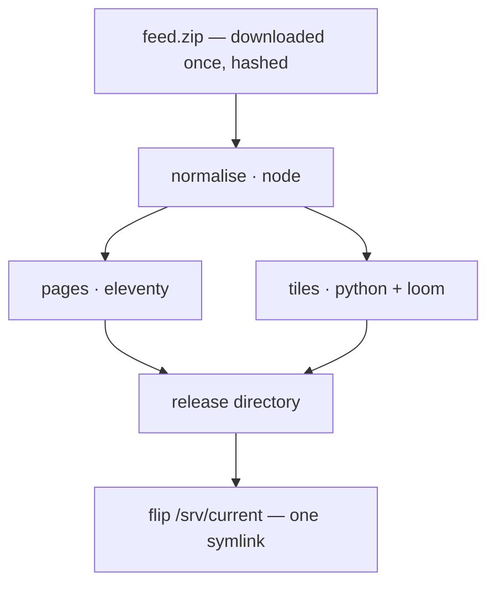

# Atomic release pipeline

**Status:** proposed, not built. Written to be argued with.

## The problem

The app and the map are built from the feed independently, so they drift. This
is not hypothetical — it is the state of the system today:

| | served stops |
|---|---|
| feed the tile pipeline had cached | 683 |
| feed the app loaded | 656 |

Twenty-seven of the stops on the map were retired by the agency months ago. They
are drawn, labelled, and their popups link to stop pages that return 404. The
tiler had skipped its feed download on every run since May, and nothing
anywhere was in a position to notice.

Publishing the app's cleaned stop names to the tiler fixed *what* the two
halves disagree about. It cannot fix *when*. Only one build can do that.

## The shape

One feed in, one cutover out.



Normalising is a build step, not a database write. That is the change that
makes everything else fall out: once the feed's processed form is a *file*, the
site build, the tile build and the running worker are all consumers of the same
artifact, and a release is a directory that either exists completely or does
not exist at all.

## Decisions taken

**Redis comes out first, before the pipeline work.** It is the one piece of
state a symlink cannot switch, so leaving it in means designing a second
consistency mechanism (versioned keyspaces, a pointer key, transactions) and
then deleting it. It is also, since the API tier was retired, read by exactly
one process.

**Everything runs on the box.** One `docker compose`, one command, nothing
external. No bucket, no CI artifacts, no registry beyond the image.

**One fat builder image**, composed from the tiler's published image so a
release is reproducible from one app commit plus one pinned digest.

**Two cadences.** Releases build when the feed changes, because they are cheap
and riders should not wait a day for a schedule change. The basemap rebuilds
monthly at 2am under a hard memory cap, because it is the only heavy job and
the buses are not running.

**The cutover is a symlink flip.** nginx resolves the path per request, so
pages, data and tiles switch in the same instant, with no reload and no
downtime.

## On disk

```
/srv/releases/<build-id>/
    site/            pages, built by eleventy
    tiles/           transit.pmtiles, styles, sprites, fonts
                     basemap.pmtiles — hardlink, not a copy
    static.json      the normalised feed the worker reads
    manifest.json    feed hash, app version, tiler digest, built at
    data ->          symlink to /srv/data/<build-id>
/srv/current -> releases/<build-id>
/srv/data/<build-id>/    arrivals, vehicles, alerts — tmpfs, keyed by build
/srv/basemap/        basemap-<hash>.pmtiles, shared by every release
/srv/planetiler/     source cache: water polygons, Natural Earth (1.4 GB)
```

**Arrivals belong to the release.** They read as live data because they are
rewritten every few seconds, but they are overwhelmingly the timetable: one row
is 345 bytes of schedule against 55 bytes of realtime, and on a typical stop
only 9 of 20 rows carry a prediction that differs from the schedule at all. A
release changes the schedule, so it changes the arrivals — leaving them outside
would mean a page built from the new feed polling a file written from the old
one, which is the drift this whole document exists to remove.

What kept them out was write churn: 158 of 656 files are rewritten every six
seconds, about 240 KB/s, which belongs in RAM rather than on a VPS disk. Both
properties survive by keying the tmpfs directory to the build and pointing at
it from the release, so one symlink flip still switches pages, tiles, schedule
and arrivals together.

The builder seeds that directory from the new schedule before the flip — the
same schedule-only render it already splices into the pages — so a release is
complete the instant it becomes current rather than a tick later. Data
directories are pruned with their releases, so a rollback keeps its arrivals.

After a reboot the tmpfs is empty, so `/data` 404s for the second it takes the
worker's first tick, while pages serve from disk carrying whatever was last
spliced into them. The staleness notice covers exactly that: the page says the
times are old rather than presenting them as live.

The basemap is hardlinked rather than copied — 117 MB per release would be
absurd, and its URL already carries a content fingerprint, so browsers keep it
cached across every feed rebuild.

## Release identity

A release is identified by what went into it, not when it was made:

```json
{
  "feedHash": "af3951aa",
  "appVersion": "<git sha>",
  "tilerImage": "ghcr.io/…/gtfs-route-tiles@sha256:…",
  "builtAt": "2026-08-16T06:00:00Z"
}
```

The builder rebuilds when any of the first three differ from the current
release. That covers the case a feed hash alone would miss: a template edit
deploys new code against an unchanged feed and must still produce a release.

## Phase 1 — Redis out, a file in

Redis holds 71 MB, of which 59.7 MB is one hash: 128,751 expanded stop-time
instances, each carrying a full copy of its route *and* its trip.

```json
{"serviceDate":"20260820","tripId":"No Schoolh-BtUypR2l2","stopId":"0:260",
 "scheduledTime":1787230922000,
 "route":{"routeId":"2","routeShortName":"2","routeColor":"#FFC000",…},
 "trip":{"tripId":"No Schoolh-BtUypR2l2","routeId":"2","serviceId":"No School",…}}
```

Normalised, those four real fields are ~90 bytes rather than ~470.

**What the release file carries:** stops with cleaned names, routes, trips,
stop times per trip, calendar dates, and the feed hash. A few megabytes.

**What it does not carry:** expanded instances, because the three-day window is
relative to *now* and not to the build; and route shapes, which have been dead
weight since the map became vector tiles — `routes_with_shapes` is 3.1 MB that
nothing has read since `getLines` was deleted, and dropping it means never
parsing `shapes.txt`.

**What the worker does with it:** loads it at startup and on cutover, expands
instances in memory (~128k rows, tens of megabytes against a 512 MB limit), and
answers "next 20 departures after T at stop X" with a binary search over a
per-stop sorted array — the one job the 656 Redis sorted sets were doing.

**A bug this fixes.** `loadStatic` returns early when the feed hash is
unchanged, so instances — which only cover three days forward — are rebuilt
*only when the agency republishes*. A feed that goes unchanged for more than
three days, with no worker restart, leaves no upcoming arrivals at all.
Restarts on deploy have been hiding it. Expansion becomes a daily job over the
schedule, where the bug cannot recur.

**Also removed:** the `ioredis` dependency, the redis service and its volume,
the async `Model` interface, and the `SKIP_STOPS` escape hatch in CI — the site
build reads a file, so it no longer needs a database to run.

## Phase 2 — releases and the flip

The builder writes to `releases/<id>.partial`, renames it to `releases/<id>`
when every step has succeeded, and only then swaps the pointer:

```sh
ln -s "releases/$ID" /srv/current.new
mv -T /srv/current.new /srv/current      # atomic rename, no window
```

nginx roots move to `/srv/current/site` and `/srv/current/tiles`. The worker
watches the symlink's target and reloads its static data and page shells when
it changes — the mechanism it already has for noticing an external rebuild.

Keep three releases; prune the rest. Rollback is the same two commands against
an older directory.

## Phase 3 — the tiler moves in

The builder image composes the two toolchains rather than reimplementing
either:

```dockerfile
FROM ghcr.io/…/gtfs-route-tiles@sha256:… AS tiler
FROM node:24-bookworm-slim
COPY --from=tiler /usr/local/bin/gtfs2graph /usr/local/bin/topo /usr/local/bin/loom /usr/local/bin/
COPY --from=tiler /app /opt/tiler
RUN apt-get install -y --no-install-recommends python3 openjdk-21-jre-headless …
```

`pipeline.sh` gains a "use this feed" mode instead of downloading its own, and
the per-feed run skips the basemap entirely, hardlinking the shared one into
the release before `make_style.py` fingerprints it.

Node coordinates by spawning processes, which is what it already does for
Eleventy. The whole orchestrator:

```ts
const feed = await downloadFeed();
if (unchanged(feed)) return;
const dir = await stage(feed);          // normalise → static.json
await Promise.all([buildSite(dir), buildTiles(feed, dir)]);
await flip(dir);
await prune();
```

There is no queue, no DAG engine and no Docker socket. Failure handling is
`try`/`catch`: anything that throws means `flip` is never reached.

## Phase 4 — the basemap, capped

A second cron in the same builder, monthly at 2am, guarded by a lock so it can
never overlap a release build:

```yaml
builder:
  deploy:
    resources:
      limits:
        memory: 1G
```

Run planetiler with `-Xmx768m --storage=mmap` so it spills to disk rather than
fighting the box for RAM. The cgroup limit means an overrun kills *that*
container: the failure mode is "the basemap job died and the site kept
serving", not "the box fell over".

Each stage pings its own heartbeat URL, so a wedged `loom` is distinguishable
from a wedged download rather than both looking like silence.

## Phase 5 — demolition

Remove `TILES_DIR`, the worker's own feed download and site build, the
redis service, and the transitional paths left over from the Next.js
migration.

## Failure modes

| what fails | what happens |
|---|---|
| feed download | no build; heartbeat reports; previous release serves |
| normalise | staged directory discarded before any flip |
| loom or tiling | same — the release never becomes current |
| eleventy | same |
| flip | previous symlink is untouched; it is a rename |
| worker restarts mid-build | reads the current release; unaffected |
| reboot | pages and tiles serve from disk; arrivals 404 until the first tick, and the pages say their times are stale |
| basemap overruns memory | its container dies; releases keep using the last good basemap |

## Unknowns worth measuring before building

1. **Does loom fit a capped container** on a 14-route feed? Everything else in
   the per-feed build is known to be small — `transit.pmtiles` is 0.38 MB and
   tiling takes seconds.
2. **Does planetiler complete at `-Xmx768m --storage=mmap`?** The 8 GB in
   `pipeline.sh` is a default nobody measured; Maine's extract is 87 MB, and
   the 1.5 GB of sources is global auxiliary data, cached once.
3. **How much disk is free on the box?** Steady state is ~1.7 GB with sources
   cached, or ~150 MB if they are deleted after each basemap build and
   re-downloaded monthly.
4. **How long does a per-feed release take end to end?** It sets how stale the
   app can be after a feed publishes.

## Not doing

Object storage or a CDN; CI-built artifacts and the pull mechanism they need;
Airflow, Argo, or any DAG runner; keeping Redis for a single reader; versioned
Redis keyspaces, which the release directory makes unnecessary.
